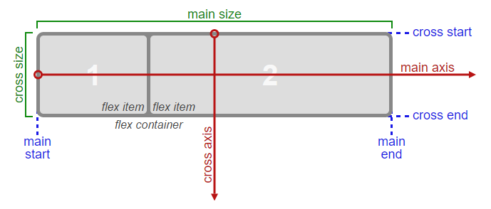

# SCSS Masterclass

(S)CSS Layout Masterclass: Flexbox & Grid ([nomadcoder](https://nomadcoders.co/css-layout-masterclass))

## Flexbox

- First Rule: Flex Container Wrapper

  ```css
  .wrapper {
    display: flex;
  }
  ```

- Main Axis and Cross Axis

  ```css
  .wrapper {
    display: flex;
    flex-direction: row;    /* column, ... */
    justify-content: space-around;    /* flex-start, center, stretch, ... */
    align-items: center;    /* flex-start, flex-end, ... */
  }
  ```

  - flex-direction: decise Main Axis (default is "flex-direction: row;")

    

  - justify-content: change Main Axis's Item-Position
  - align-items: change Cross Axis's Item-Position
